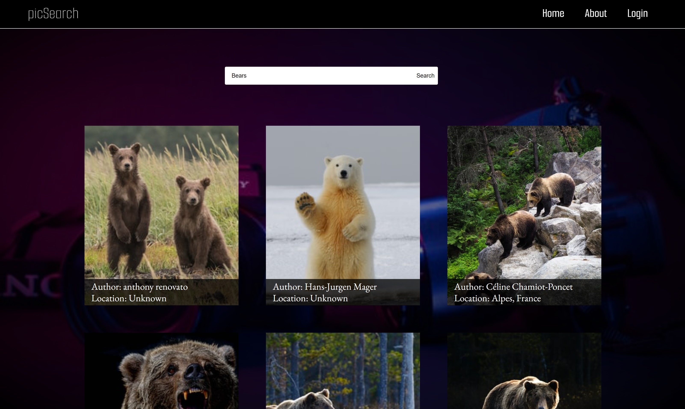

# picSearch

Use the picSearch Microapp to search for images with the Unsplash API

## Instructions to Run

<ol>
  <li>Clone this Repo.</li>
  <li>On line 8 of "./src/components/searchResultBlock.js", insert your unique   API Key for Unsplash acquired by making an account here:  https://unsplash.com/developers</li>
  <li>In the terminal, navigate to the root directory of the project.</li>
  <li>Using npm, run the following command: "npm run start".</li>
</ol>

### Enjoy!
